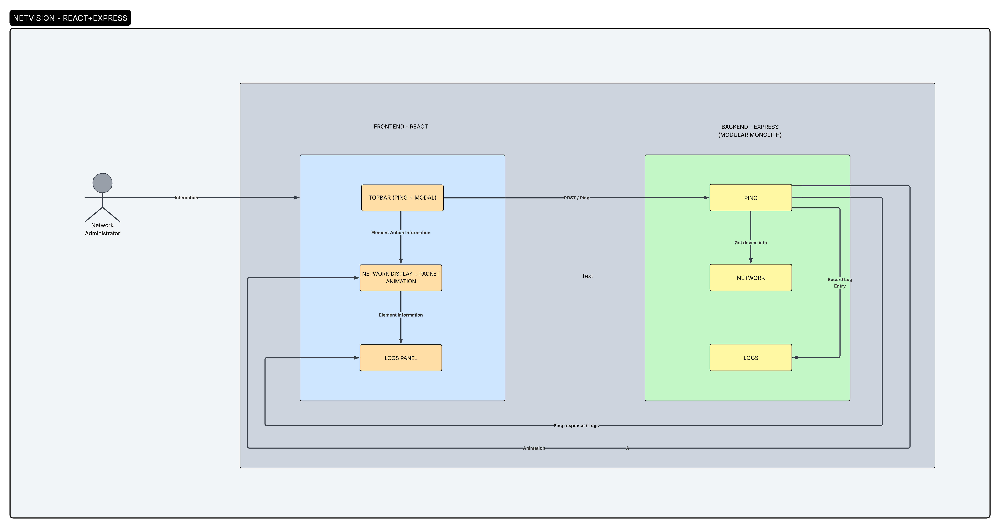

<!-- header -->
<pre align="center"> 
    _   __     __ _    ___      _           
   / | / /__  / /| |  / (_)____(_)___  ____ 
  /  |/ / _ \/ __/ | / / / ___/ / __ \/ __ \
 / /|  /  __/ /_ | |/ / (__  ) / /_/ / / / /
/_/ |_/\___/\__/ |___/_/____/_/\____/_/ /_/ 

</pre>


# NetVision: Network Simulation System

NetVision is an interactive network simulation system built with **React**, **React Flow**, and **Node/Express**. It allows visualization and simulation of devices, ARP requests, ICMP ping flows, MAC learning, and packet animations in a network.

---

## Table of Contents

- [Overview](#overview)  
- [Device Classes](#device-classes)  
- [Device Components](#device-components)  
- [React Flow Integration](#react-flow-integration)  
- [Network Actions](#network-actions)  
  - [ARP Requests](#arp-requests)  
  - [MAC Learning](#mac-learning)  
  - [ICMP and ARP Packet Animations](#icmp-and-arp-packet-animations)  
- [Logs and Ping](#logs-and-ping)  

---

## Overview

Every device in NetVision is represented as a backend object (Node/Express) and a reusable front-end React component. Devices can be **PCs**, **Switches**, or **Routers**.  

Key features include:

- Ping simulation (ICMP)  
- ARP requests and MAC table updates  
- Packet animations (unicast and multicast)  
- Real-time log display  
- React Flow-based network visualization  

---

## System Diagram

 

---

## Device Classes

### Base Device Class

```javascript
export class Device {
  constructor(deviceName, mac, arp = [], type) {
    this.deviceName = deviceName;
    this.mac = mac;
    this.arp = arp;
    this.type = type;
  }

  async log(actionType, targetIP, layer, message) {
    await logEvent(actionType, this, targetIP, layer, message);
  }

  async ping(destinationIP, round = 0, limit = 5) {
    if (round > limit) return console.log("Ping process complete");

    const receivingDevice = this.arp.find(entry => entry.ip === destinationIP);
    if (!receivingDevice) {
      await this.log("ARP Request", destinationIP, "Layer 2", `Who has ${destinationIP}?`);
      await arpRequest(this, destinationIP);
      await this.ping(destinationIP, round + 1, limit);
    } else {
      await this.log("ICMP Request", destinationIP, "Layer 3", `ICMP ECHO from ${this.mac} to ${receivingDevice.mac}`);
      await this.ping(destinationIP, round + 1, limit);
    }
  }
}
```
---

## Device Subclasses
```javascript

export class PC extends Device {
  constructor(deviceName, mac, arp = [], ip, networkInterface, lan) {
    super(deviceName, mac, arp, "pc");
    this.ip = ip;
    this.networkInterface = networkInterface;
    this.lan = lan;
  }
}

export class Switch extends Device {
  constructor(deviceName, mac, arp = [], ip, networkInterface, lan) {
    super(deviceName, mac, arp, "switch");
    this.ip = ip;
    this.networkInterface = networkInterface;
    this.lan = lan;
    this.macTable = [];
  }
}

export class Router extends Device {
  constructor(deviceName, mac, arp = [], ip = [], networkInterfaces) {
    super(deviceName, mac, arp, "router");
    this.ip = ip;
    this.networkInterfaces = networkInterfaces;
  }
}
```
---
## Device Components
### NetworkDevice Component
```tsx
export type NetworkDeviceProps = {
  Logo: ReactElement;
  deviceId: number;
};

const NetworkDevice: FC<NetworkDeviceProps> = ({ Logo, deviceId }) => {
  const context = useContext(AppContext);
  if (!context) return console.log("Network Device must be inside AppProvider");

  const { devices } = context;
  const requiredDevice = devices[deviceId];

  return (
    <figure className="device-figure">
      <Tippy content={<AdditionalInfo />}>
        <div className="device-icon">{Logo}</div>
      </Tippy>
      <h3>{requiredDevice?.deviceName || "PC X"}</h3>
    </figure>
  );
};

export default NetworkDevice;
```
---
## React Flow Integration
```tsx

const DeviceNode: React.FC<NodeProps<NetworkDeviceProps>> = ({ data }) => (
  <div>
    <NetworkDevice Logo={data.Logo} deviceId={data.deviceId} />
    <Handle type="source" position={Position.Right} />
    <Handle type="target" position={Position.Left} />
  </div>
);

const nodeTypes = { deviceNode: DeviceNode };

const initialNodes = [
  { id: "1", type: "deviceNode", position: { x: 0, y: 0 }, data: { Logo: <MdComputer size={48} />, deviceId: 0 } },
  { id: "2", type: "deviceNode", position: { x: 0, y: 400 }, data: { Logo: <MdComputer size={48} />, deviceId: 1 } },
];

const initialEdges = [{ id: "e1-2", source: "1", target: "2", type: "straight" }];

export default function NetworkFlow() {
  return (
    <div className="network-flow">
      <ReactFlow nodes={initialNodes} edges={initialEdges} nodeTypes={nodeTypes}>
        <Background />
      </ReactFlow>
    </div>
  );
}
```
---
## Network Actions
### ARP Requests
``` javascript
export async function arpRequest(sourceDevice, destinationIP) {
  const destinationDevice = devices.find(d => d.ip === destinationIP);
  if (!destinationDevice) return console.log("Device not in network");

  sourceDevice.arpTable.push({ mac: destinationDevice.mac, ip: destinationDevice.ip });
  broadcast({ type: "devices", devices });
  return { sourceDevice, destinationDevice };
}
MAC Learning (Switch)
javascript
Copy code
export async function learnMac(sourceDevice) {
  const homeSwitch = devices.find(d => d.type === "switch" && d.lanSegment === sourceDevice.lanSegment);
  if (!homeSwitch.macTable.find(e => e.mac === sourceDevice.mac)) {
    homeSwitch.macTable.push({ mac: sourceDevice.mac, interface: sourceDevice.networkInterface });
    broadcast({ type: "devices", devices });
  }
}
```
---
## ICMP and ARP Packet Animations
```javascript

export async function animateICMPEvent(sourceDevice, destinationDevice) {
  const route = craftRoute(destinationDevice, sourceDevice);
  const data = JSON.stringify({ type: "ICMPRoute", routes: route });
  wss.clients.forEach(client => client.readyState === WebSocket.OPEN && client.send(data));
}

export function animateARPEvent(sourceDevice, destinationDevice) {
  const mainRoute = craftRoute(destinationDevice, sourceDevice);
  const otherDevices = devices.filter(d => d.type === "pc" && d.ip !== destinationDevice.ip && d.ip !== sourceDevice.ip);
  const holderArray = otherDevices.map(device => craftRoute(device, sourceDevice).slice(0, Math.floor(craftRoute(device, sourceDevice).length / 2)));
  holderArray.push(mainRoute);

  const data = JSON.stringify({ type: "ARPRoute", routes: holderArray });
  wss.clients.forEach(client => client.readyState === WebSocket.OPEN && client.send(data));
}
```
## Logs and Ping
### Logs Component
``` tsx
function Logs(): ReactElement {
  const [logsArray, setLogsArray] = useState<LogType[]>([]);
  useEffect(() => {
    const socket = new WebSocket("wss://netvision-service.onrender.com");
    socket.onmessage = (event) => {
      const data = JSON.parse(event.data);
      if (data.type === "newLog") setLogsArray(prev => [...prev, { layer: data.layer, message: data.message }]);
    };
    return () => socket.close();
  }, []);

  return (
    <section>
      <SectionTitle name="Logs" />
      {logsArray.map((log, idx) => <Log key={idx} message={log.message} />)}
    </section>
  );
}
```
## Ping Modal
```tsx

function PingModal(): ReactElement {
  const context = useContext(AppContext)!;
  const { setShowPing, isSubmitting, setIsSubmitting, setAuthErrorMsg } = context;
  const sourceRef = useRef<HTMLInputElement | null>(null);
  const destinationRef = useRef<HTMLInputElement | null>(null);

  async function handleSubmit(e: React.FormEvent) {
    e.preventDefault();
    if (isSubmitting) return;
    setIsSubmitting(true);

    const sourceName = sourceRef.current?.value || "";
    const destinationName = destinationRef.current?.value || "";

    try {
      const res = await fetch("https://netvision-service.onrender.com/api/ping/sendPing", {
        method: "POST",
        headers: { "Content-Type": "application/json" },
        body: JSON.stringify({ sourceName, destinationName }),
      });
      const data = await res.json();
      if (data.error) setAuthErrorMsg(data.error);
    } finally {
      setIsSubmitting(false);
      setShowPing(false);
    }
  }

  return (
    <form onSubmit={handleSubmit}>
      <input ref={sourceRef} placeholder="Source Device" />
      <input ref={destinationRef} placeholder="Destination Device" />
      <button type="submit" disabled={isSubmitting}>{isSubmitting ? "pinging" : "ping"}</button>
    </form>
  );
}
```